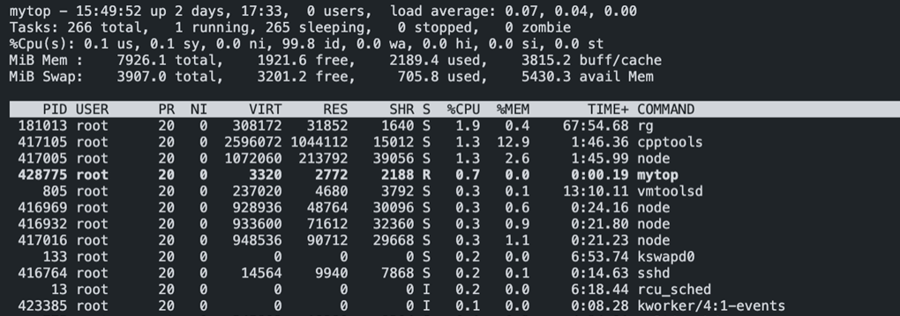
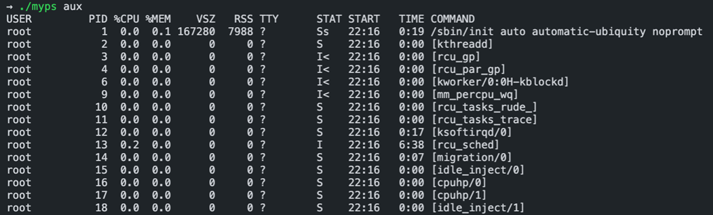
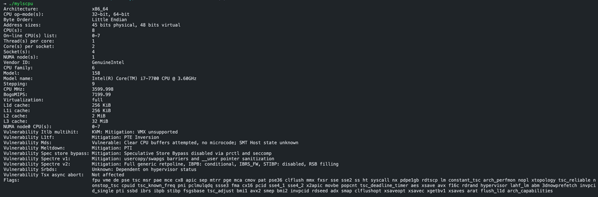

# Linux Command

리눅스 명령어인 top, ps, lscpu 명령어 구현

## 0. Quick start

``` bash
$ git clone https://github.com/codejune/c-linux-command.git
$ cd c-linux-command

# 일괄 빌드
$ make

# 개별 빌드
$ make mytop
$ ./mytop
```

## 1. Environment

### Software

- Ubuntu 20.04.3 LTS (x86_64)
- Linux Kernel 5.11.22

### Hardware

- VM Instance
- 4 Core 8 Thread
- 8 GB RAM
- 60 GB Storage

## 2. Requirement

### 조건

- system() or exec() 계열 함수를 사용하여 해당 명령어를 호출 금지
- mytop, myps 명령어는 리눅스 top, ps 명령어와 최대한 유사한 결과를 출력하게 구현
- mylscpu 명령어의 경우 필수 구현 항목은 CPU Vendor ID, CPU 모델명, CPU 속도, 캐쉬 크기(L1i, L1d, L2 캐쉬) 이며 그 외의 항목은 추가 option으로 취급

### 출력

- mytop

    

- myps

    

- mylscpu

    
