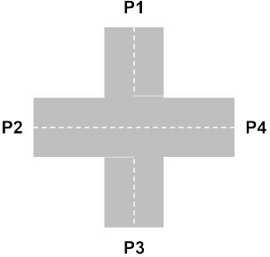

# Intersection

Pthread를 이용하여 교차로에서의 차량 진입 문제 해결 프로그램 구현하기

## 0. Quick start

``` bash
git clone https://github.com/codejune/c-intersection.git
cd c-intersection
make
./intersection
```

## 1. Environment

### Software

- Ubuntu 20.04.3 LTS (x86_64)
- Linux Kernel 5.11.22

### Hardware

- VM Instance
- 4 Core 8 Thread
- 8 GB RAM
- 60 GB Storage

## 2. Requirement

십자 모양의 교차로에서 동서남북 각 도로의 출발점을 P1, P2, P3, P4 라고 함



### 입력

- 자동차 대수(N): min 10, max 15
- 교차로 방향(M): min 1, max 4
- ex) N=10 입력 → 1에서 4 사이의 랜덤 숫자 10개 생성 (2 3 1 1 2 3 4 1 4 3)

### 조건

- 각 출발 지점(P1-4)에서의 차량 출발은 각각 다른 쓰레드가 제어
  - 최소 4개의 쓰레드가 각각 P1, P2, P3, P4에서의 차량 출발 여부를 결정
- 1초마다 출발 지점(P1-4)의 순서대로 차량이 출발 가능
- 각각의 출발점에서는 마주 보는 방향으로만 진행할 수 있음
  - (P1↔P3), (P2↔P4)
- 차량이 출발점을 출발하여 교차로를 빠져나가 도착하는데 약 2초의 시간이 소요
- 차로는 한 방향으로 한 번에 한 대의 차량만 지나갈 수 있음
  - 즉, 편도 차선은 최대 한 대 의 차량만 점유 가능함
- 인접한 위치의 차량이 차로를 점유하고 있을 때는 진행이 가능할 때까지 대기함
  - P2의 경우 인접한 위치의 차로는 P1과 P3를 의미함
- 마주 보는 위치의 차량이 차로를 점유하고 있을 때는 그대로 진행 가능함
- 대기하는 차량은 한 번에 한 대만 진행이 가능함
- 대기하는 차량이 두 대 이상 존재할 경우 랜덤하게 하나의 차량이 선택됨

### 출력

- 프로그램 시작 시 전체 진행되는 차량의 수, 진행되는 출발 지점 리스트를 출력함
- 매 초마다 교차로를 빠져나가는 차량의 정보와 대기 중인 차량의 정보를 출력함
- 모든 차량에 대한 진행이 완료된 후에는 각 출발점마다 총 진행된 차량 수, 모든 차량이
통고하는데 걸린 총 걸린 시간을 출력함

``` bash
./intersection
```
